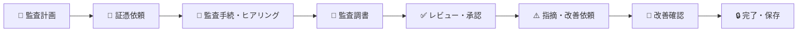
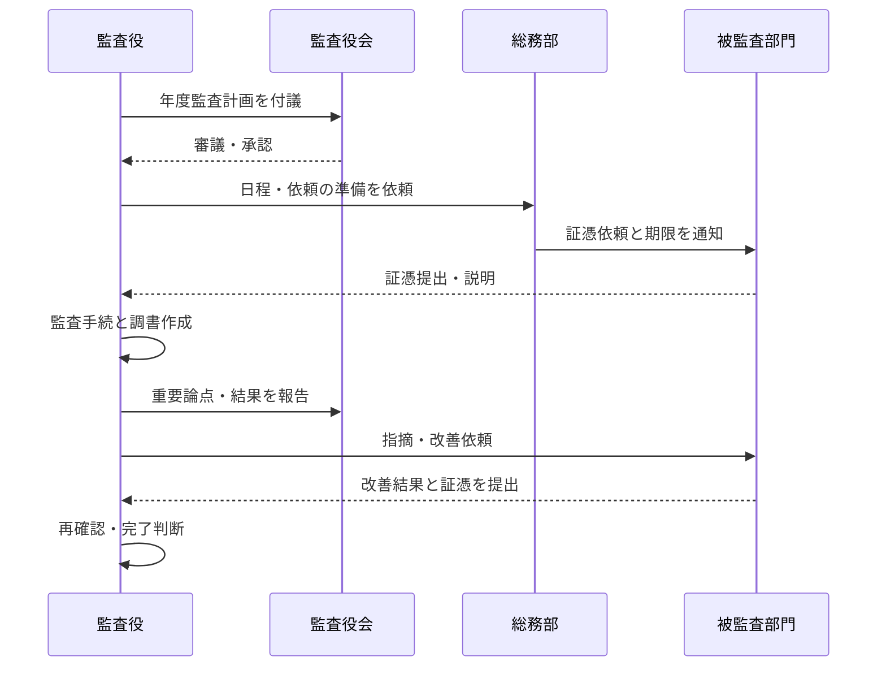
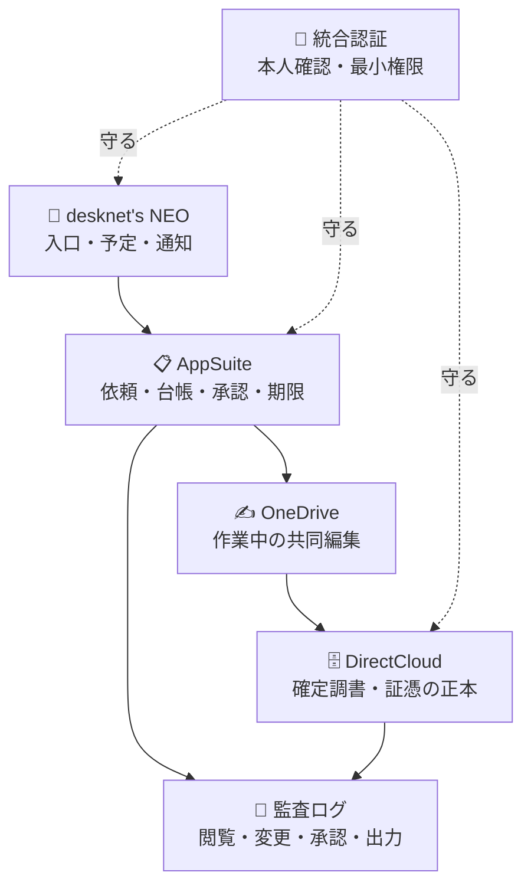

# 🧭 Mirai Audit Workpaper

> 監査の計画から、証拠の受け渡し、監査調書のレビュー、指摘事項の改善確認までを、迷わず・漏れなく・後から説明できる形で進めるためのプロジェクトです。

## 🌱 このプロジェクトで実現したいこと

監査では、結論だけでなく「何を確かめ、どの資料を根拠に、誰が確認したか」を残すことが大切です。本プロジェクトは、監査役、監査役会、総務部、被監査部門が同じ流れを見ながら、必要な情報だけを安全に受け渡せる仕組みを目指します。

現在のワークスペースにあるのは、既存資料を基に整理した**構想・要件・設計文書**です。稼働中のアプリケーションや実装コードはまだ含まれていません。正式運用の前に、社内規程、保存年限、決裁権限、利用製品、責任者を確定する必要があります。

## 👥 皆さまにとっての役割

| 利用者 | この仕組みで行うこと | 期待できること |
|---|---|---|
| 🧑‍⚖️ 監査役 | 監査計画、監査手続、判断根拠、指摘、フォローアップを記録する | 証拠と結論のつながりを説明しやすくなる |
| 🏛️ 監査役会 | 監査計画・重要論点・監査結果を審議し、承認記録を残す | 審議の経緯と決定事項を追跡しやすくなる |
| 🗂️ 総務部 | 日程調整、依頼・督促、会議運営、文書整理を支援する | 期限、提出状況、確定版の所在を把握しやすくなる |
| 🏢 被監査部門 | 求められた証憑を提出し、事実確認と改善対応を行う | 依頼内容・期限・差戻し理由が分かりやすくなる |

> 🔐 被監査部門は、自部門への依頼と許可された資料だけを扱います。監査役の検討メモ、他部門の資料、未確定の評価を閲覧できる前提ではありません。

## 🗺️ 監査の全体像

## 🚦 情報の状態を混同しないために

| 表示 | 意味 | 取り扱い |
|---|---|---|
| ✅ 確定 | 正式な承認を経た情報 | 確定版として保存し、変更時は履歴を残す |
| 🟡 作業中 | 作成・確認・差戻しの途中 | 関係者だけで扱い、対外利用しない |
| 🔵 計画 | 今後実装・導入する要件 | 製品選定や規程確認の後に確定する |
| ⚪ 未確定 | 判断材料や責任者が不足 | 決定者と期限を決めて課題管理する |

## 📚 文書の入口

### まず読む文書

- [要件定義書](要件定義書.html) — 誰のために、何を、どこまで実現するか
- [詳細仕様設計書](詳細仕様設計書.html) — 画面、データ、権限、処理、例外の設計
- [ドキュメント一覧](docs/ドキュメント一覧.md) — 目的別の文書ナビゲーション
- [プロジェクト概要](docs/プロジェクト概要.md) — 背景、目的、対象範囲、成功条件
- [業務フロー](docs/業務フロー.md) — 役割ごとの実務の流れ
- [変更履歴・意思決定記録](docs/変更履歴.md) — 文書変更と判断の時系列台帳
- [実装・導入バックログ](docs/実装・導入バックログ.md) — PoC・実装・導入の優先度順作業一覧

### 役割別のおすすめ

| 読む人 | 最初に読む文書 |
|---|---|
| 🧑‍⚖️ 監査役 | [監査年間計画・個別監査運用ガイド](docs/監査年間計画・個別監査運用ガイド.md)、[監査調書作成・レビュー手順](docs/監査調書作成・レビュー手順.md) |
| 🏛️ 監査役会 | [要件定義書](要件定義書.html)、[リスク・課題・前提条件一覧](docs/リスク・課題・前提条件一覧.md) |
| 🗂️ 総務部 | [業務フロー](docs/業務フロー.md)、[証跡・文書管理方針](docs/証跡・文書管理方針.md)、[導入・教育・定着計画](docs/導入・教育・定着計画.md) |
| 🏢 被監査部門 | [業務フロー](docs/業務フロー.md)、[利用者・権限一覧](docs/利用者・権限一覧.md)、[用語集](docs/用語集.md) |

## 🔐 大切な約束

- 監査判断、法的評価、処分、承認は人が行います。AIやシステムが自動決定しません。
- 必要な人に必要な範囲だけを見せます。異動・退職・担当変更時は権限を見直します。
- 証憑は出所、対象期間、提出者、受領日時、版を記録し、確定後の差替えを履歴に残します。
- 個人情報、通報者情報、未公表情報を、承認されていないAIサービスへ入力しません。
- 保存年限、廃棄、リーガルホールドは社内規程と法務確認に基づいて確定します。
- システムは監査を支援しますが、職業的懐疑心や独立した判断を置き換えません。

## 🧩 想定する情報の置き場所

既存資料では、役割を次のように分ける構想です。製品名と運用は未確定であり、導入決定ではありません。

## 📌 正式運用までに決めること

1. 監査役会規程、監査基準、職務分掌、決裁権限との整合
2. 調書・証憑・指摘・会議記録の保存年限と廃棄承認者
3. 監査役、補助使用人、総務部、被監査部門の閲覧・編集・承認範囲
4. 重要度、指摘区分、期限超過、エスカレーションの基準
5. 利用製品、データ連携、バックアップ、復旧目標、費用、運用責任者
6. 個人情報・機密情報・AI利用に関する社内ルール
7. 受入試験、教育、試行監査、本番移行の承認条件

## 🗃️ 既存の基礎資料

- [業務内容一覧（HTML）](業務内容一覧.html) / [Markdown](業務内容一覧.md)
- [システム要件一覧（HTML）](システム要件一覧.html) / [Markdown](システム要件一覧.md)
- [システム化アイデア一覧](システム化アイデア一覧.html)

これらは経営・統治・委員会領域全体を扱う資料です。本プロジェクトの文書は、その中から「監査業務・証跡管理」を中心に具体化しています。原典は `Mirai-DX-Planning-Resources/01_経営・統治・委員会/` にあり、本リポジトリ直下の複製を参照・管理の基準とします（取込時のハッシュ照合は [変更履歴](docs/変更履歴.md) に記録）。

## ⚖️ 文書利用上の注意

本資料群はプロジェクト検討用です。法令適合性、監査基準への適合、保存義務、個人情報の取扱いについて法的助言を行うものではありません。正式決定時は、監査役会、法務・コンプライアンス、情報セキュリティ、個人情報保護責任者、システム管理部門の確認を受けてください。

---

📅 文書基準日: 2026年8月15日（原典資料）／リポジトリ運用開始: 2026年8月16日  
📍 状態: 構想・要件定義段階（実装コードなし・文書のGit管理・リンク検証を整備済み）
