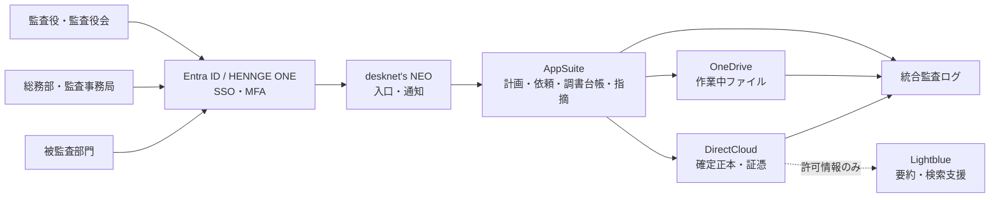

# システム構成・アーキテクチャ

## 1. 文書情報

| 項目 | 内容 |
|---|---|
| 対象 | 監査業務・証跡管理（Mirai Audit Workpaper） |
| 目的 | 監査計画、証憑、監査調書、指摘、是正確認を安全に連携する構成を定義する |
| 根拠資料 | [システム化アイデア一覧](../システム化アイデア一覧.html)、[システム要件一覧](../システム要件一覧.md)、[業務内容一覧](../業務内容一覧.md) |
| 状態 | 構想設計。製品契約、実装、接続試験は未確認 |

## 2. 状態区分

- **基礎資料上の確定**：既存5ファイルに明記された方針。
- **承認待ち案**：本書で具体化した設計。正式決定には規程、契約、情報システム部門の承認が必要。
- **未確認**：現物・設定・試験結果がなく、実現済みとは扱えない事項。

## 3. 基礎資料上の確定事項

1. AppSuiteで監査計画、テーマ、手続、調書、指摘、改善期限を管理する。
2. desknet's NEOで証憑依頼、ヒアリング予定、改善督促を通知する。
3. OneDriveは監査人の作業・共同編集に用い、DirectCloudには確定調書、受領証憑、是正完了証憑の正本を置く。
4. 認証はEntra ID／HENNGE ONEを優先し、監査対象部門から論理分離した最小権限、閲覧履歴、保存期間、リーガルホールドを備える。
5. AIは整理・要約・検索を支援するに留め、監査判断を行わない。

## 4. 論理構成（承認待ち案）

## 5. コンポーネント責務

| 構成要素 | 主責務 | 保持してよい情報 | 禁止・制約 |
|---|---|---|---|
| desknet's NEO | ポータル、日程、通知 | 案件番号、期限、通知状態 | 機微な所見本文や証憑本体を通知本文に載せない |
| AppSuite | 業務台帳、ワークフロー、レビュー状態 | 監査計画、手続、依頼、所見、指摘、是正状態 | 正本ファイルの重複保管を避ける |
| OneDrive | 作業中ファイルの共同編集 | 草稿、作業メモ | 確定版の正本扱い、無期限保管をしない |
| DirectCloud | 正本・証憑の保存 | 受領証憑、確定調書、承認済報告書、完了証憑 | 任意上書き・無承認削除を許可しない |
| Entra ID／HENNGE ONE | 認証、MFA、条件付きアクセス | ID・所属・認証属性 | 共有IDを原則禁止 |
| 統合監査ログ | 閲覧・変更・承認・出力の追跡 | 操作者、時刻、対象、操作、結果 | 業務利用者による改変・削除を禁止 |
| Lightblue | 許可済文書の要約・検索 | 匿名化・機密区分許可済み情報 | 通報者情報、要配慮個人情報、未承認調書の投入禁止 |

## 6. 境界と情報フロー

| フロー | 起点 → 終点 | 統制 |
|---|---|---|
| 証憑依頼 | AppSuite → desknet's NEO → 被監査部門 | 期限、依頼者、対象、受領確認を記録 |
| 証憑受領 | 被監査部門 → 隔離受領領域 → DirectCloud | マルウェア検査、形式確認、ハッシュ、出所、受領時刻 |
| 調書確定 | OneDrive → レビュー → DirectCloud | 作成・レビュー・承認の職務分離、版固定 |
| 指摘通知 | AppSuite → 被監査部門 | 承認済み内容のみ通知、機密範囲を制御 |
| AI利用 | DirectCloud等 → 審査済み連携 → Lightblue | 情報分類、マスキング、入力・出力ログ、人による確認 |

## 7. 配備・環境分離（承認待ち案）

- 本番、受入、設定検証の3環境を論理分離する。
- 本番データを非本番へ複製しない。必要時は匿名化・最小化したテストデータを用いる。
- 接続資格情報は秘密情報管理機能に置き、ソース・文書・設定票へ平文記載しない。
- API連携はTLS、サービスID、最小スコープ、レート制限、再送時の重複防止を必須とする。

## 8. 未確認事項・設計判断

| ID | 論点 | 現状 | 決定者 |
|---|---|---|---|
| ARC-01 | AppSuite／DirectCloud間の連携方式 | 未確認 | DX推進・製品管理者 |
| ARC-02 | OneDriveとDirectCloudの正本移管方式 | 未確認 | 総務部・監査役 |
| ARC-03 | 統合ログの保管先と改ざん防止方式 | 未確認 | 情報セキュリティ責任者 |
| ARC-04 | 災害時の代替連絡・オフライン手順 | 未確認 | 総務部・BCP責任者 |
| ARC-05 | Lightblueへ投入可能な情報区分 | 未確認 | 監査役・法務・情報管理責任者 |

