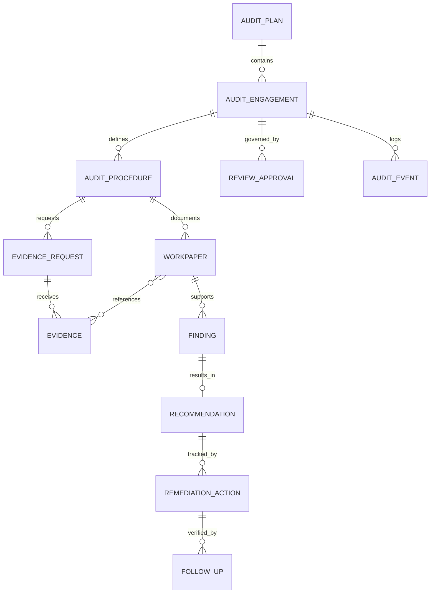

# データモデル・データ辞書

## 1. 位置付け

本書は、既存資料に明記された監査計画、監査手続、証憑、調書、発見事項、指摘、是正確認を、一貫した識別子で追跡するための**論理データ案**である。物理DB、製品内フィールド名、型・桁数は未確定であり、実装済みではない。

## 2. 概念モデル（承認待ち案）

## 3. エンティティ辞書

| エンティティ | 主キー例 | 必須主要項目 | 機密性 | 保存先案 |
|---|---|---|---|---|
| 年度監査計画 | plan_id | 年度、目的、承認状態、承認日 | 社内限定 | AppSuite |
| 個別監査 | engagement_id | テーマ、対象、期間、責任者、状態 | 機密 | AppSuite |
| 監査手続 | procedure_id | 目的、手続内容、担当、期限、結論 | 機密 | AppSuite |
| 証憑依頼 | request_id | 依頼先、依頼物、期限、状態 | 機密 | AppSuite |
| 証憑 | evidence_id | 出所、受領日時、版、ファイル参照、ハッシュ | 内容により極秘 | DirectCloud（正本） |
| 監査調書 | workpaper_id | テンプレート版、作成者、レビュー状態、結論 | 極秘 | DirectCloud（確定） |
| 発見事項 | finding_id | 事実、基準、原因、影響、重要度、根拠 | 極秘 | AppSuite／正本参照 |
| 改善提言 | recommendation_id | 提言、合意状態、承認者 | 機密 | AppSuite |
| 是正措置 | action_id | 責任者、計画、期限、進捗、完了申告 | 機密 | AppSuite |
| フォローアップ | follow_up_id | 確認日、確認者、証憑、判定、再確認日 | 機密 | AppSuite／DirectCloud |
| レビュー・承認 | approval_id | 対象、役割、判断、日時、コメント | 機密 | AppSuite |
| 監査イベント | event_id | 操作者、時刻、操作、対象、結果、接続元 | 機密 | 統合監査ログ |

## 4. 主要属性定義

| 項目名 | 定義 | 形式案 | 必須 | 入力・統制 |
|---|---|---|---|---|
| engagement_id | 個別監査を一意に識別 | `AUD-YYYY-NNNN` | ○ | 自動採番、再利用禁止 |
| status | 業務状態 | 列挙値 | ○ | 状態遷移表以外の変更禁止 |
| confidentiality | 情報区分 | 公開／社内／機密／極秘 | ○ | 初期値は機密、格下げは承認制 |
| source | 証憑の作成元・提出元 | 組織・システム・人物参照 | ○ | 自由記述だけにしない |
| received_at | 証憑を受領した時刻 | ISO 8601、JST表示 | ○ | サーバー時刻で記録 |
| content_hash | 受領時点の同一性確認値 | SHA-256等 | ○ | アルゴリズムは要決定 |
| version | 文書の版 | 正の整数 | ○ | 上書きせず新しい版を生成 |
| fact | 発見事項として確認した事実 | テキスト | ○ | 評価・推測と分離 |
| criterion | 事実と比較する基準 | 規程・法令・計画等への参照 | ○ | 根拠文書・版・条項を保持 |
| severity | 発見事項の重要度 | 重大／高／中／低等 | ○ | 基準は監査役会承認が必要 |
| due_date | 証憑提出・是正の期限 | 日付 | ○ | 変更理由・承認を履歴化 |
| legal_hold | 廃棄停止状態 | true／false | ○ | 解除権限を限定 |

## 5. 状態遷移案

> 基準: [要件定義書](../要件定義書.html) 4.1 の状態遷移を上位の標準とし、本書は運用上の詳細状態（一部受領、差戻し、見解相違等）を併記する。正式な状態遷移表は監査役会規程・業務ルール確定後に承認する。

| 対象 | 状態遷移 |
|---|---|
| 個別監査 | 起案 → 承認待ち → 実施中 → 報告レビュー → 完了 → 保管 |
| 証憑依頼 | 下書き → 発行済 → 一部受領 → 受領済 → 受入確認済／差戻し → 完了 |
| 調書 | 下書き → 作成完了 → レビュー中 → 差戻し／承認済 → 確定・保管 |
| 指摘 | 起案 → 事実確認 → 合意／見解相違 → 承認済 → 是正中 → 確認済／再指摘 → 完了 |

## 6. 品質・整合性ルール

1. 調書の結論は、1件以上の監査手続と根拠証憑に結び付ける。
2. 証憑は出所、受領日時、版、保管場所、ハッシュが揃うまで「受入確認済」にしない。
3. 指摘は事実、基準、原因、影響、重要度、根拠を分離して記録する。
4. 完了判定には、是正責任者の申告だけでなく監査側の確認者・確認日・確認根拠を必須とする。
5. 人名や組織はマスター参照とし、異動後も当時の所属・役割を履歴として保持する。

## 7. 未確定事項

- 保存年限、廃棄起算日、リーガルホールド解除手続。
- 重要度区分と監査役会への報告閾値。
- 個人情報・要配慮個人情報・営業秘密の詳細分類。
- 製品間で用いる共通ID、API形式、文字・時刻・タイムゾーン仕様。
- 物理的な一意制約、索引、容量、添付ファイル上限。

