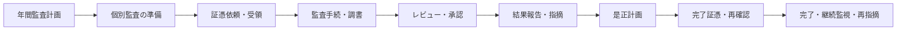

# 監査業務・証跡管理プロジェクト概要

## 1. このプロジェクトが目指すこと

本プロジェクトは、監査役・監査役会が行う年間計画、個別監査、監査調書、指摘、改善確認を、証跡とともに一貫して管理する仕組みを整える計画です。情報整理と記録を支援しますが、監査判断、監査意見、改善完了の判断をシステムやAIへ委ねません。

## 2. 現在地

| 区分 | 内容 |
|---|---|
| 実装済み | 本ワークスペースには、業務内容、システム要件、システム化アイデアの整理資料がある |
| 計画 | AppSuiteで計画・手続・調書・指摘・期限を管理し、desknet's NEOで依頼・予定・督促を通知する |
| 計画 | OneDriveを作業・共同編集、DirectCloudを確定調書・受領証憑・完了証憑の正本保管に使い分ける |
| 未確定 | 製品採用、連携方式、画面、データ項目、移行範囲、稼働日、予算、運用責任者 |

> 「計画」は要件・構想を示し、利用可能な機能を意味しません。稼働実装、試験、利用実績は現資料から確認できません。

## 3. 主な利用者と期待効果

| 利用者 | 主な利用目的 | 期待する効果 |
|---|---|---|
| 監査役 | 計画、手続、調書、発見事項、監査意見、フォローアップ | 根拠から判断までの追跡性向上 |
| 監査役会 | 年間計画・重要論点・結果の共有、レビュー・承認 | 審議資料と結論の一元把握 |
| 総務部 | 日程調整、依頼・通知、会議事務、権限事務の補助 | 期限・連絡漏れの抑制 |
| 被監査部門 | 証憑提出、質問回答、是正計画・完了証憑の提出 | 依頼内容と期限の明確化 |

## 4. 対象業務

対象は、職務執行監査、会計・内部統制監査、指摘・改善フォローアップです。会計監査人や内部監査部門との計画・論点・発見事項の共有も業務上想定されていますが、共有範囲と権限は未確定です。

## 5. 基本方針

- 被監査部門から監査情報を論理的に分離し、必要最小限の権限とする。
- 誰が、いつ、何を閲覧・変更・承認・出力したかを記録する。
- 作業中の草稿と承認済み正本を明確に分ける。
- 証憑の出所、受領日、版、関連手続を追跡できるようにする。
- AIは要約や検索の補助に限定し、監査判断を行わせない。
- 保存期間、廃棄承認、リーガルホールドは正式な社内規程に基づき決定する。

## 6. 成功の確認方法（案）

以下は導入時に合意する候補であり、目標値は未確定です。

- 計画から調書、証憑、指摘、是正結果まで相互にたどれる割合
- 期限超過の証憑依頼・改善項目の件数
- レビュー差戻し理由が記録されている割合
- 権限棚卸し、アクセス記録、正本登録の実施率
- 利用者教育の受講率と、操作・運用問い合わせ件数

## 7. 関連文書

- [業務フロー](業務フロー.md)
- [利用者・権限一覧](利用者・権限一覧.md)
- [監査年間計画・個別監査運用ガイド](監査年間計画・個別監査運用ガイド.md)
- [監査調書作成・レビュー手順](監査調書作成・レビュー手順.md)
- [証跡・文書管理方針](証跡・文書管理方針.md)
- [用語集](用語集.md)

