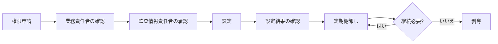

# 利用者・権限一覧

## 1. 前提

本書は最小権限と職務分離のための権限設計案です。原典では、監査対象部門から論理的に分離した権限、閲覧履歴、エクスポート制限、追記専用の監査ログが要件として示されています。具体的な起案者、確認者、承認者、閲覧者は未確定です。

## 2. 基本ロール案

記号：○＝原則実施、△＝担当範囲・許可時のみ、―＝原則不可。すべて計画上の案です。

| 操作 | 監査役 | 監査役会メンバー | 総務部（事務局） | 被監査部門責任者 | 被監査部門提出者 | システム管理者 |
|---|:---:|:---:|:---:|:---:|:---:|:---:|
| 年間・個別計画の作成 | ○ | △ | △ | ― | ― | ― |
| 計画の承認 | △ | ○ | ― | ― | ― | ― |
| 証憑依頼の作成・送付 | ○ | △ | △ | ― | ― | ― |
| 自部門への依頼閲覧 | ― | ― | △ | ○ | ○ | 原則― |
| 自部門の証憑提出 | ― | ― | △ | ○ | ○ | 原則― |
| 他部門の証憑閲覧 | ○ | △ | 必要時のみ | ― | ― | 原則― |
| 監査調書の作成・編集 | ○ | △ | 原則― | ― | ― | ― |
| 監査調書のレビュー・承認 | △ | ○ | ― | ― | ― | ― |
| 指摘・結果の確定 | ○ | △ | ― | ― | ― | ― |
| 自部門の是正計画・証憑提出 | ― | ― | △ | ○ | ○ | 原則― |
| 改善完了の判断 | ○ | △ | ― | ― | ― | ― |
| 利用者・権限設定 | ― | ― | △ | ― | ― | ○ |
| 監査ログの閲覧 | ○ | 権限時のみ | 権限時のみ | 原則― | ― | 運用上必要な範囲 |
| 記録の削除・廃棄 | 単独不可 | 承認時のみ | 手続補助 | ― | ― | 承認済み手続のみ |

## 3. 情報区分と閲覧範囲案

| 情報区分 | 例 | 基本的な閲覧範囲 | 状態 |
|---|---|---|---|
| 監査共通 | 年間日程、一般連絡 | 監査役、監査役会、必要な総務部 | 計画 |
| 監査限定 | 個別計画、調書、発見事項、監査意見 | 指定された監査関係者 | 計画 |
| 提出者共有 | 証憑依頼、提出物、差戻し理由 | 対象監査の監査役と指定された被監査部門 | 計画 |
| 高機密 | 通報者情報、個人情報、未公表情報等を含む資料 | 個別に承認された最小人数 | 区分・取扱い未確定 |
| 正本 | 承認済み調書、監査報告、確定証憑 | 保存・閲覧権限を持つ者 | 計画 |

## 4. 権限管理の運用案

- 入社、異動、退職、監査担当の変更時に付与・変更・剥奪する計画です。
- 特権IDは期限付き承認とし、通常業務用IDと分離する計画です。
- 四半期棚卸しが共通要件に示されていますが、責任者と証跡様式は未確定です。
- システム管理者であっても業務内容を常時閲覧できない設計が望まれます。実現方式は未確定です。
- 利益相反がある場合のアクセス停止・代替担当指定の規則は未確定です。

## 5. 導入前の確認事項

1. 監査役会規程、職務分掌、決裁権限規程に基づく正式ロール
2. 総務部が閲覧できる監査情報と、日程・通知だけを扱う範囲
3. 会計監査人、内部監査部門、外部専門家のアカウントと共有方法
4. 緊急時アクセス、代理、兼務、利益相反時の扱い
5. 出力、印刷、ダウンロード、外部共有の許可条件
6. 権限棚卸しの実施者、承認者、頻度、記録様式

