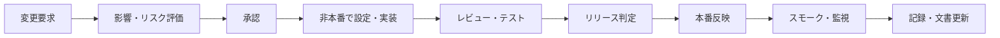

# 変更管理・リリース計画

## 1. 目的

監査証跡・権限・正本を損なう変更を防ぎ、要求から本番反映まで追跡可能にする。現時点でリポジトリに実装コード、CI、リリース履歴は確認できないため、本書は将来運用案である。

## 2. 変更区分

| 区分 | 例 | 審査・承認 |
|---|---|---|
| 標準 | 文言、通知時刻、承認済み帳票レイアウト | 業務責任者＋管理者 |
| 通常 | フィールド、ワークフロー、連携、レポート | 影響評価、テスト、業務責任者、システム責任者 |
| 重大 | 権限、保存、監査ログ、正本、AI、外部共有 | 監査役、情報セキュリティ、システム責任者。必要に応じ監査役会 |
| 緊急 | 漏えい封じ込め、重大障害復旧 | 緊急承認後に実施し、翌営業日までに事後審査案 |

## 3. 変更フロー

## 4. 変更票の必須項目

- 変更ID、目的、要求・指摘・障害への参照、対象構成・データ。
- 影響する機能、役割、個人情報、監査ログ、保存、連携、帳票。
- テストケース、データ移行、実施者・確認者、実施希望日時。
- バックアップ、ロールバック条件・手順、利用者周知。
- 承認者、実施結果、差異、残存リスク、文書更新先。

## 5. リリースゲート

| ゲート | 必須条件 |
|---|---|
| 要求 | 受入基準、対象・対象外、トレーサビリティが明確 |
| 設計 | セキュリティ、個人情報、運用、移行、ロールバックをレビュー |
| 品質 | 必須テスト100%、Blocker/Critical 0件、重大未解決リスクなし |
| 業務 | 監査役・関係部門の受入承認、手順・教育・問い合わせ体制が準備済み |
| 運用 | 監視、バックアップ、復元、連絡網、構成台帳が準備済み |
| 本番 | 実施責任者と中止判断者を指定し、変更凍結・周知を完了 |

## 6. リリース方式案

- 原則として小さな変更単位で、非本番 → 限定利用 → 全体利用の順に展開する。
- 監査繁忙期、監査役会直前、決算・重大事案対応中は重大変更を凍結する。
- DB・台帳項目変更は後方互換、移行前バックアップ、件数照合、切戻し可能性を確認する。
- SaaS自動更新は事前通知、リリースノート、影響、テスト可能期間を管理し、重要変更は受入環境で確認する。

## 7. リリース後確認

1. SSO、主要5業務、権限拒否、監査ログ、通知、正本参照のスモークテスト。
2. 連携エラー、性能、権限異常、データ件数を集中監視。
3. 成功基準未達、情報漏えい、データ不整合、証跡欠落時は直ちに中止・切戻し判断。
4. 変更票、構成台帳、操作手順、データ辞書、テスト証跡を更新する。

## 8. バージョン・記録案

- リリース番号は `YYYY.MM.N` または組織標準に統一する。
- 要求ID → 変更ID → 設定／成果物 → テストID → 承認 → 本番反映記録を連結する。
- 本番設定の直接変更は禁止し、緊急時も操作ログと事後レビューを必須とする。

## 9. 未確定事項

- ソース・設定の管理場所、CI/CD、環境、リリース責任者、定例リリース日。
- SaaS更新の停止可否、受入期間、ロールバック可否。
- 緊急変更の承認者・時間外連絡先・事後審査期限。

