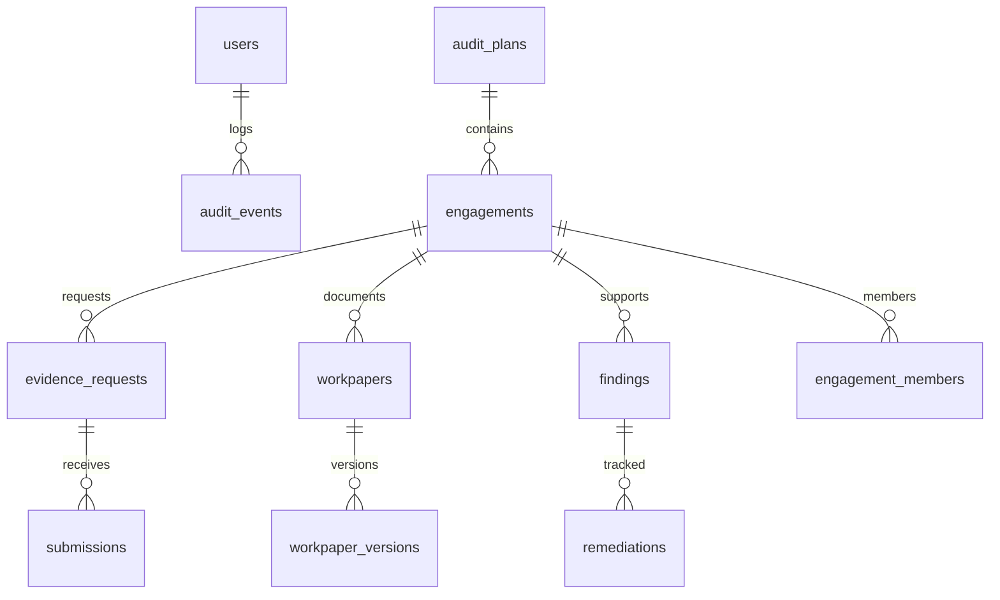

# 実装計画（CTO決定版）

## 1. 決定事項

- **日付**: 2026-08-16
- **決定者**: CTO（全権限委譲済み）
- **技術スタック**: Cloudflare Workers (Hono) + D1 (SQLite) + ネイティブHTML/JS SPA（Vite） + TypeScript + node:test
  - 会社既存標準（mirai-board-audit-governance と同一スタック）に合わせる（React は未使用。単一HTML埋め込みSPA）
- **デプロイ先**: Cloudflare Workers + D1（新規 worker・DB を作成）
- **環境分離**: preview（検証用）→ production（本番）の2段階
- **実装場所**: 本ワークスペース `app/` ディレクトリ（文書群と共存。既存文書は変更しない）

## 2. 実装スコープ（垂直スライス）

要件定義書（MAW-RD-001）の機能要件から、P0・P1・P2の主要機能を垂直スライスで実装する。
画面・API・DB・認可・監査ログ・テスト・文書まで揃える。

| 対象 | 要件ID | 内容 |
|---|---|---|
| 認証 | NFR-01 | セッションCookie + パスワードハッシュ(Web Crypto) + ロール |
| RBAC | FR-12, NFR-02 | ロール×操作権限、案件隔離、利益相反 |
| 監査ログ | FR-13 | 追記専用ログ（誰が・いつ・何を・結果） |
| 年度監査計画 | FR-01 | CRUD + 承認状態 + 版 |
| 個別監査案件 | FR-02 | CRUD + 状態遷移 + 案件番号採番 |
| 証憑依頼・受領 | FR-03, FR-04 | 依頼CRUD、提出、ハッシュ、状態 |
| 監査調書 | FR-05, FR-06 | 作成・レビュー依頼・確定（版管理） |
| 発見事項・指摘 | FR-06, FR-07 | 事実・基準・重要度・被監査部門回答 |
| 改善フォロー | FR-07 | 是正計画・完了証憑・再確認 |
| ダッシュボード | FR-11 | 自分のタスク・期限・状態一覧 |

### 対象外（バックログへ）
- AI要約・類似検索（FR-15）— 将来構想
- 会計監査人連携（IF-04）— 別システム
- 通知基盤（desknet's NEO連携）— 社内SaaS選定待ち。アプリ内通知で代替

## 3. DBスキーマ（D1 / SQLite）

主要テーブル: users, audit_plans, engagements, engagement_members, evidence_requests, submissions, workpapers, workpaper_versions, findings, remediations, audit_events
全テーブルに created_at / updated_at。削除は原則禁止（論理削除もせず状態で管理）。

## 4. API一覧（/api/v1）

| メソッド/パス | 内容 | 権限 |
|---|---|---|
| POST /api/auth/login | ログイン（セッション発行） | 公開 |
| POST /api/auth/logout | ログアウト | 認証済み |
| GET /api/me | 自分 + タスク | 認証済み |
| GET/POST /api/plans | 計画一覧/作成 | 監査役・事務局 |
| GET/PUT /api/plans/:id | 計画詳細/更新 | 監査役 |
| POST /api/plans/:id/approve | 承認 | 監査役会 |
| GET/POST /api/engagements | 案件一覧/作成 | 監査役・事務局 |
| GET/PUT /api/engagements/:id | 案件詳細/更新 | 案件メンバー |
| POST /api/engagements/:id/status | 状態遷移 | 監査役 |
| GET/POST /api/engagements/:id/requests | 証憑依頼 | 監査役 |
| POST /api/requests/:id/submissions | 証憑提出 | 被監査部門（自部門のみ） |
| GET/POST /api/engagements/:id/workpapers | 調書 | 監査役 |
| POST /api/workpapers/:id/review | レビュー依頼 | 作成者 |
| POST /api/workpapers/:id/approve | 確定 | レビュー者 |
| GET/POST /api/engagements/:id/findings | 発見事項 | 監査役 |
| POST /api/findings/:id/responses | 部門回答 | 被監査部門 |
| POST /api/findings/:id/remediations | 是正計画登録 | 監査役・被監査部門（自部門のみ） |
| POST /api/remediations/:id/verify | 再確認・完了判定 | 監査役 |
| GET /api/audit-events | 監査ログ | 監査役・管理者 |

## 5. フロントエンド画面

- ログイン
- ホーム（自分のタスク・期限）
- 計画一覧/詳細
- 案件一覧/詳細（依頼・調書・指摘タブ）
- 証憑依頼・提出
- 調書作成・レビュー
- 指摘・是正

## 6. テスト・検証

- ユニット: 認証、権限、状態遷移、ID採番
- 統合: APIフロー（計画→案件→依頼→提出→調書→指摘→是正）
- セキュリティ: 権限外アクセス拒否、他部門案件不可視
- E2E相当: 主要シナリオ（UAT-01〜05, 06, 10）

## 7. リリース手順

1. app/ で実装・テスト・ビルド（テスト76件・CI green が前提）
2. preview デプロイ → スモーク（https://mirai-audit-workpaper-preview.kensan1969.workers.dev）
3. MVP デプロイ → スモーク（https://maw-mvp.mirai-dx-platform.com、npm run deploy:mvp / wrangler.mvp.jsonc）
4. D1 migration 本番適用（冪等）
5. production デプロイ → スモーク（https://maw.mirai-dx-platform.com、npm run deploy:production / wrangler.production.jsonc）
6. 本番スモーク・監査ログ確認（bootstrap 403・health・ログイン可否）

## 8. リスクと対策

| リスク | 対策 |
|---|---|
| 監査データの機密性 | 実データ不使用。シードはダミー・テストデータのみ。ロール×案件の認可を厳格に |
| 監査判断の自動化 | 完了・重要度は人の操作のみ。システムは自動判定しない |
| 既存文書との混同 | app/ に分離。リンク検証スクリプトはdocs対象のまま |
| デプロイ失敗 | preview で検証後 production。rollback は旧バージョン再デプロイ |

---

## 9. 実装状況（2026-08-16 現在・検証済み）

- **実装済み（app/ ディレクトリ・検証PASS）**: 認証（セッションCookie + PBKDF2）、RBAC（5ロール×操作権限＋案件隔離）、監査ログ（追記専用）、年度計画（承認フロー＋却下）、個別案件（状態遷移）、証憑依頼（送付・提出・一部受領・受領・差戻し・締切）、調書（版管理・レビュー依頼・差戻し・確定）、指摘・是正（回答・事実確認・是正計画・進捗・再確認）、ダッシュボード（自分のタスク）、管理者ユーザー管理（作成・更新・無効化/再有効化・パスワード再設定）。
- **検証結果**: 型チェック PASS / lint PASS（警告0）/ テスト 76件 PASS（単体+統合・health死活含む）/ ビルド PASS / リンク検証 PASS（92MD + 20HTML）。テストは AC-01〜05（業務フロー）、AC-06（権限外拒否）、CSRF、レート制限、Cookie Secure、状態遷移、bootstrap本番拒否、ユーザー管理（UAT-08）、是正進捗、監査ログlimit、セッション無効化に加え、独立レビュー指摘の回帰（依頼/調書/指摘/是正のアクセス制御・年度グローバル採番・指摘状態機械・シードハッシュ形式）を網羅。
- **セキュリティ強化**: CSRF（Origin/Referer検証）、ログイン・APIレート制限（isolate内・バケット掃除）、Cookie Secure属性（HTTPS時）、セキュリティヘッダー（CSP・HSTS・X-Frame-Options: DENY・nosniff・Referrer-Policy・Cache-Control: no-store）、CORS全開放の除去、bootstrapのSecrets化（環境変数パスワード・Git非管理）、PBKDF2反復回数範囲検証、パスワード変更後の他セッション無効化、証憑提出APIへの案件アクセスチェック。
- **環境分離**: preview（mirai-audit-workpaper-preview + mvp-DB）／production（mirai-audit-workpaper + main-DB）。productionではbootstrap実行不可。
- **CI/CD**: GitHub Actions（.github/workflows/ci.yml: リンク検証＋型/lint/テスト/ビルド＋gitleaksシークレットスキャン、deploy.yml: main push で preview/MVP 自動デプロイ・production は workflow_dispatch target=production の手動のみ）。CLOUDFLARE_API_TOKEN / CLOUDFLARE_ACCOUNT_ID を secrets に設定済みで有効。
- **未実装（バックログへ）**: ユーザー管理（利用者ライフサイクル）、SSO/MFA連携、ファイル実体保存（R2）、通知（desknet's NEO）、AI要約、正本庫連携（DirectCloud）、レポート生成、リーガルホールド。実データ投入は社内決定後。
