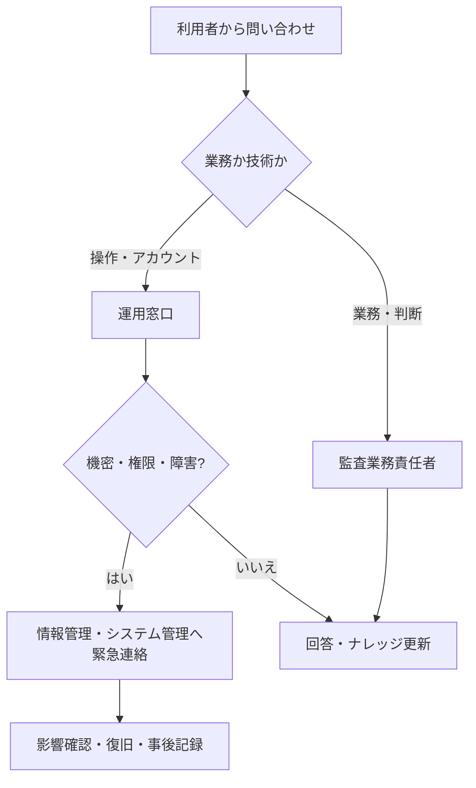

# 導入・教育・定着計画

## 1. 目的

監査業務・証跡管理の仕組みを、監査役、監査役会、総務部、被監査部門が安全に使える状態へ段階的に移行するための計画案です。製品採用、対象組織、日程、予算、移行量、責任者は未確定です。

## 2. 段階導入案

| 段階 | 主な作業 | 完了確認案 |
|---|---|---|
| 1. 方針確認 | 対象業務、社内規程、保存年限、責任者、AI利用境界を確定 | 未確定事項に責任者と期限がある |
| 2. 設計 | 業務フロー、データ、権限、正本、ログ、例外を設計 | 監査役・総務部・被監査部門が役割を確認 |
| 3. 試作 | 代表的な計画・証憑依頼・調書・指摘を設定 | 主要シナリオを操作できる |
| 4. 試行 | 限定した監査テーマ・部門で並行運用 | 問題、手戻り、権限不備を記録できる |
| 5. 改善 | 試行結果を反映し、手順・教育・設定を更新 | 重大な未解決事項が判定されている |
| 6. 展開 | 対象を段階拡大し、問い合わせ窓口を運用 | 対象者の教育と権限確認が完了 |
| 7. 定着 | KPI、権限、ログ、手順を定期確認 | 改善会議と更新履歴が継続している |

## 3. 利用者別の教育案

| 対象 | 必須テーマ | 演習例 |
|---|---|---|
| 監査役 | 計画、証憑依頼、調書、レビュー、指摘、フォローアップ、機密情報 | 計画から正本登録までの一連操作 |
| 監査役会 | 計画・結果の確認、レビュー・承認、未解決事項 | 承認と差戻し、重要論点の確認 |
| 総務部 | 日程・通知、依頼補助、権限申請、問い合わせ一次対応 | 監査通知、期限督促、誤送信防止 |
| 被監査部門責任者 | 依頼確認、担当割当、是正計画、期限管理 | 証憑提出と差戻し対応、是正計画提出 |
| 被監査部門提出者 | 安全な証憑提出、版・出所・対象期間、個人情報 | 正しい依頼への提出と再提出 |
| システム管理者 | 最小権限、ログ、バックアップ、障害・アカウント対応 | 異動時の権限変更と記録確認 |

## 4. 教材案

- 役割別クイックガイド
- 年間計画・個別監査の操作演習
- 証憑提出チェックリスト
- 調書作成・レビュー例
- 正本・草稿・版管理の事例
- 個人情報・機密情報・AI利用の禁止事項
- 誤送信、誤権限、誤削除、障害時の連絡手順

教材の承認者、更新頻度、受講期限、理解度確認、未受講者への対応は未確定です。

## 5. 移行方針案

既存の年間計画、進行中監査、未完了指摘、必要な確定調書・証憑を分類し、移行対象を決めます。すべての過去資料を無条件に移すことは想定せず、法令・規程・検索必要性・機密性・品質・費用から判断します。

移行時には件数照合、ファイル読取、メタデータ、権限、版、正本性を確認し、元資料の廃棄は別途承認まで行いません。具体的な移行対象と検証基準は未確定です。

## 6. 問い合わせ・障害時の体制案

連絡先、受付時間、重大度、応答目標、代替手段は未確定です。

## 7. 定着確認指標（候補）

- 対象者の教育受講率・演習完了率
- 証憑提出の期限内完了率、差戻し率
- 調書レビューの指摘分類と解消時間
- 正本登録漏れ、誤権限、誤送信、重複登録の件数
- 未完了指摘と期限超過の件数
- 問い合わせ件数、再発問い合わせ、利用者アンケート

目標値は試行結果と現行実績を基に決定します。

## 8. 稼働判定前の確認

- 正式な業務責任者・運用責任者が決まっている。
- 権限、保存、廃棄、リーガルホールド、AI利用の規則が承認されている。
- 代表シナリオ、例外、バックアップ・復旧、監査ログを検証している。
- 移行照合が完了し、未移行資料の扱いが決まっている。
- 問い合わせ、障害、誤操作、情報事故の連絡先が周知されている。
- 非エンジニア向け手順と教育が完了している。

