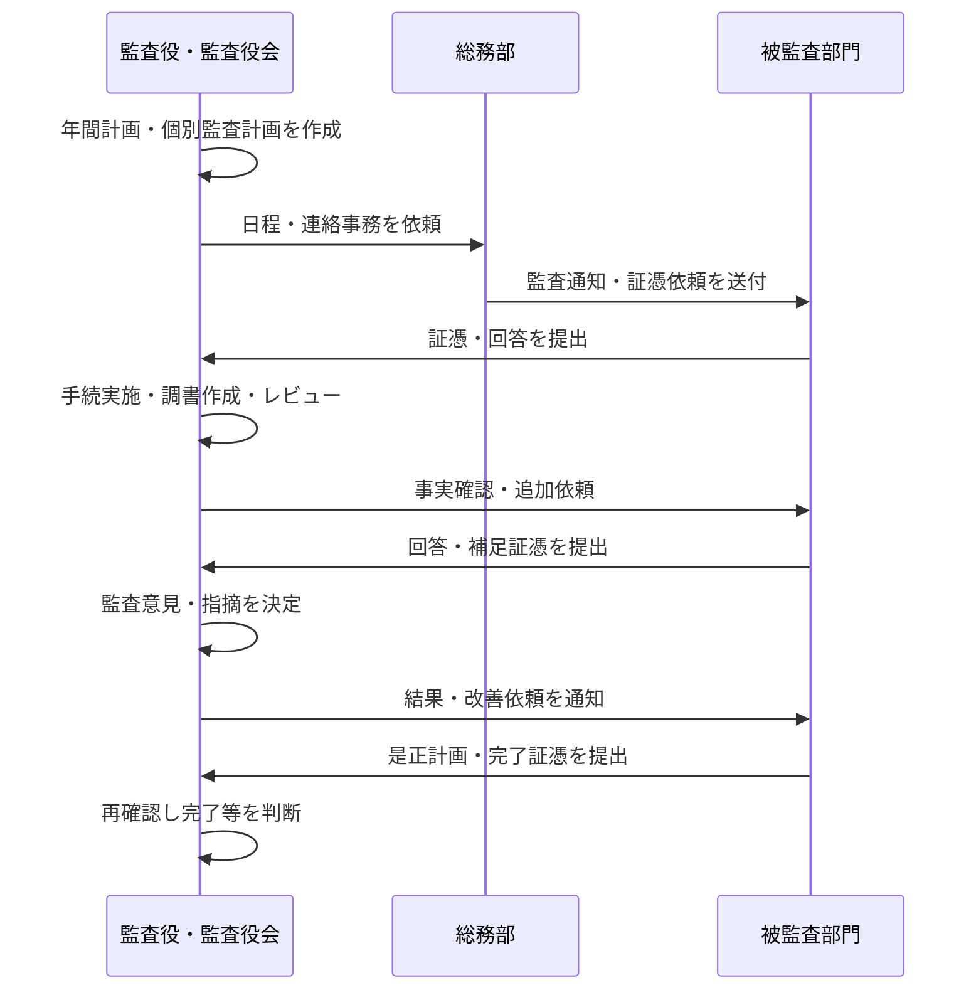
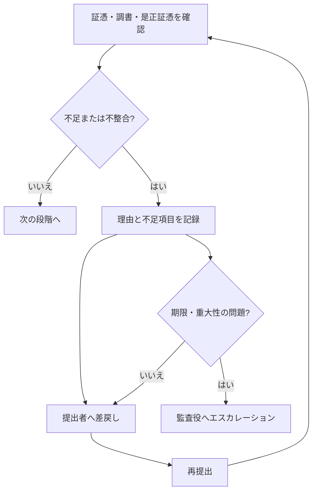

# 監査業務フロー

## 1. 位置付け

本書は、原典で示された監査計画・調書・指摘・改善確認を、利用者間の受け渡しが分かるように具体化した運用案です。正式な分掌、監査役会への付議条件、承認者、期限は未確定であり、監査役会規程、監査計画、決裁権限規程等との照合が必要です。

## 2. 全体フロー

## 3. 業務段階別の手順案

| 段階 | 主担当 | 主な入力 | 実施内容 | 主な記録・出力 | 状態 |
|---|---|---|---|---|---|
| 年間計画 | 監査役・監査役会 | リスク、前年度結果、経営環境 | テーマ、対象、時期、担当を検討 | 年間監査計画 | 計画 |
| 個別計画 | 監査役 | 年間計画、対象情報 | 目的、範囲、手続、日程、必要証憑を定める | 個別監査計画、証憑依頼一覧 | 計画 |
| 事前連絡 | 総務部または監査役 | 個別監査計画 | 通知、日程調整、提出方法案内 | 監査通知、連絡履歴 | 計画・担当未確定 |
| 証憑提出 | 被監査部門 | 証憑依頼 | 指定資料と説明を提出 | 受領証憑、回答、提出履歴 | 計画 |
| 監査実施 | 監査役 | 証憑、ヒアリング結果 | 手続、サンプリング、事実確認、評価 | 監査調書、発見事項 | 計画 |
| レビュー | 監査役・承認者 | 監査調書 | 根拠、結論、整合性、未解決事項を確認 | レビュー記録、承認記録 | 計画・承認経路未確定 |
| 結果通知 | 監査役・監査役会 | 承認済み結果 | 意見・指摘を決定し関係者へ通知 | 監査報告、指摘一覧 | 計画 |
| 是正対応 | 被監査部門 | 指摘、期限 | 責任者、対応、期限を定め実施 | 是正計画、完了証憑 | 計画 |
| 再確認 | 監査役 | 是正計画、完了証憑 | 有効性を確認 | 完了、継続監視、再指摘の判断記録 | 計画 |

## 4. 差戻し・例外フロー

- 差戻し時は、理由、対象、依頼者、期限を記録する計画です。
- 期限延長、提出不能、閲覧制限資料、外部専門家の関与が必要な場合の承認経路は未確定です。
- 監査判断と処分・法的評価は、権限を持つ人が決定します。

## 5. ツール間の役割分担（構想）

| ツール | 想定する役割 | 注意点 |
|---|---|---|
| AppSuite | 計画、手続、調書、指摘、改善期限の台帳・ワークフロー | 採用・具体設計は未確定 |
| desknet's NEO | 証憑依頼、ヒアリング予定、改善督促の通知 | 通知だけで完了とせず受領確認を残す |
| OneDrive | 監査人の作業フォルダ、共同編集 | 正本と混同しない。共有範囲は要設計 |
| DirectCloud | 確定調書、受領証憑、是正完了証憑の正本 | 保存年限・廃棄・リーガルホールドは未確定 |

## 6. 関連文書

- [監査年間計画・個別監査運用ガイド](監査年間計画・個別監査運用ガイド.md)
- [監査調書作成・レビュー手順](監査調書作成・レビュー手順.md)
- [証跡・文書管理方針](証跡・文書管理方針.md)

