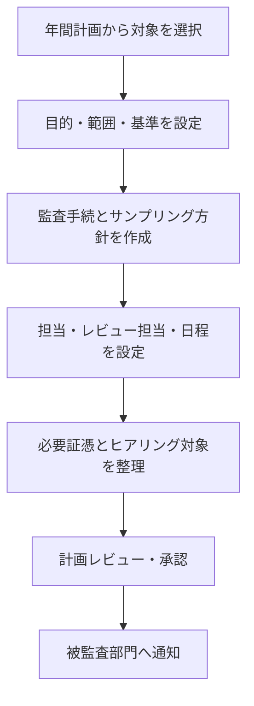

# 監査年間計画・個別監査運用ガイド

## 1. 目的と状態

年間監査計画から個別監査の完了までを同じ識別子で追跡するための運用案です。現時点ではシステム実装・正式運用を確認できず、監査役会規程や既存様式との照合も未実施です。

## 2. 年間監査計画

### 2.1 計画作成時に整理する項目案

| 項目 | 内容 |
|---|---|
| 年度・計画番号 | 年度内で一意に識別する番号 |
| 監査テーマ | 職務執行、会計、内部統制などの対象領域 |
| 目的・背景 | なぜ監査するか、どのリスクに対応するか |
| 対象 | 組織、業務、期間、拠点等 |
| 予定時期 | 準備、実施、報告、フォローアップの時期 |
| 担当 | 主担当、レビュー担当、関係者 |
| 連携 | 会計監査人・内部監査部門との共有予定 |
| 承認 | 承認者、承認日、版 |

年間計画のリスク評価方法、必須監査頻度、変更承認、監査役会への付議要件は未確定です。

### 2.2 年間計画の変更案

変更理由、影響する個別監査、変更前後、起案者、承認者、承認日を残します。重大事案等による臨時監査の追加方法は、正式規程で確定する必要があります。

## 3. 個別監査の準備

個別監査計画には、監査ID、根拠となる年間計画、目的、対象範囲、対象外、評価基準、手続、必要証憑、担当、日程、レビュー・承認を含める案です。

## 4. 証憑依頼と受領

1. 依頼ごとに依頼番号、対象監査、資料名、対象期間、提出形式、期限、目的を記録する。
2. 被監査部門は、資料の出所、作成者または所管、対象期間、版を添えて提出する。
3. 監査担当は受領日、受領者、ファイル、完全性、追加確認の要否を記録する。
4. 不足時は不足内容と理由を明記して差し戻す。
5. メール添付等の例外経路を認めるか、認める場合の登録方法は未確定とする。

## 5. 監査実施

- 実施した手続、対象母集団、抽出方法、抽出件数、結果を調書に残します。
- 事実、監査人の評価、未解決事項を分けて記述します。
- ヒアリングは日時、参加者、確認事項、回答、裏付け資料を記録します。
- 追加手続が必要になった場合は、理由と計画変更を記録します。
- 監査判断は監査役等の権限者が行います。AIの要約や候補提示を結論として扱いません。

詳細は[監査調書作成・レビュー手順](監査調書作成・レビュー手順.md)を参照してください。

## 6. 結果報告・指摘

発見事項ごとに、事実、根拠、評価基準、影響、重要度、推奨対応、対象部門の見解を関連付ける案です。重要度の定義、監査意見の区分、対象部門との事実確認期限、監査役会への報告基準は未確定です。

## 7. 是正とフォローアップ

| 記録 | 内容 |
|---|---|
| 改善責任者 | 実施責任を持つ者 |
| 是正計画 | 対応内容、対象範囲、完了条件 |
| 期限 | 合意済み期日 |
| 完了証憑 | 実施を裏付ける資料 |
| 再確認 | 確認者、日付、手続、結果 |
| 判断 | 完了、継続監視、再指摘 |

期限延長、リスク受容、代替統制、未完了の経営報告に関する承認規則は未確定です。

## 8. 完了条件案

- 計画した手続の実施状況と未実施理由が記録されている。
- 証憑と調書、発見事項、結論が相互に参照できる。
- レビュー指摘が解消済み、または未解決として承認されている。
- 結果通知と対象部門の受領が記録されている。
- フォローアップ対象、責任者、期限が設定されている。
- 承認済み正本が所定の場所へ登録されている。

