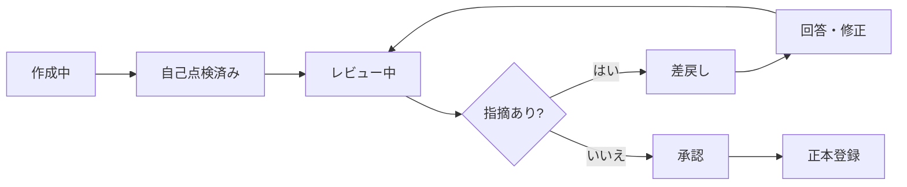

# 監査調書作成・レビュー手順

## 1. 基本原則

監査調書は、実施した監査手続、得られた証拠、事実、評価、結論を第三者が追跡できる形で残す記録です。本書は要件を実務手順へ具体化した計画案であり、正式な調書様式、署名・承認方法、監査基準は未確定です。

## 2. 調書の構成案

| 項目 | 記載内容 |
|---|---|
| 調書ID・版 | 一意な識別子、改訂番号、状態 |
| 対象監査 | 年間計画・個別監査ID |
| 目的・評価基準 | 何を何に照らして確認するか |
| 作成者・日付 | 実施者と記録日 |
| 対象・母集団 | 期間、範囲、件数、出所 |
| サンプリング根拠 | 抽出方法、件数、選定理由 |
| 実施手続 | 実施内容、実施日、結果 |
| 参照証憑 | 証憑ID、版、該当箇所 |
| 事実 | 確認できた内容 |
| 評価・結論 | 事実に基づく監査人の判断 |
| 発見事項 | 重要度、影響、原因、推奨対応 |
| レビュー | レビュー者、指摘、回答、解消日、承認 |

## 3. 作成手順

1. 承認済み個別監査計画から調書を作成し、目的と手続を引き継ぐ。
2. 証憑は直接貼り付けるだけでなく、証憑ID、版、出所、受領日、該当箇所を参照する。
3. 実施したことを過去形で具体的に記録し、未実施や例外を隠さない。
4. 「事実」「対象部門の説明」「監査人の評価」を分ける。
5. サンプリング時は母集団と抽出根拠を残す。
6. 発見事項は根拠と評価基準へ結び付ける。
7. 作成完了後に自己点検し、レビューへ提出する。

## 4. レビューフロー

状態名と承認段階は計画案です。複数段階レビュー、監査役会承認、電子署名の要否は未確定です。

## 5. レビュー観点

- 目的、手続、証憑、結果、結論が論理的につながっているか。
- 証憑の出所、版、該当箇所を特定できるか。
- 重要な例外、反証、対象部門の説明を落としていないか。
- 事実と評価を区別しているか。
- サンプルが目的に対して妥当で、抽出根拠が記録されているか。
- 発見事項の重要度と影響に根拠があるか。
- 個人情報・機密情報を必要以上に複製していないか。
- 未解決事項、追加手続、フォローアップが明確か。

## 6. レビュー指摘の扱い

レビュー指摘は削除して痕跡を消さず、指摘内容、指摘者、日時、回答、修正箇所、解消判断を記録する計画です。意見が一致しない場合の上位者判断・監査役会付議の規則は未確定です。

## 7. 版と正本

- 作業中の版はOneDrive、承認済み正本はDirectCloudで管理する構想です。
- 承認後の訂正は上書きせず、理由を付した新版として扱う案です。
- 正本登録後の編集制限、電子署名、タイムスタンプ、版番号規則は未確定です。
- 詳細は[証跡・文書管理方針](証跡・文書管理方針.md)を参照してください。

## 8. AI利用の境界

AIを使用する場合は、要約、文章の整形、類似資料の検索補助等に限定し、出力を人が原資料と照合します。個人情報、通報者情報、未公表情報等を投入できる範囲は未確定であり、承認された情報区分・サービス・手順が定まるまで投入しません。

