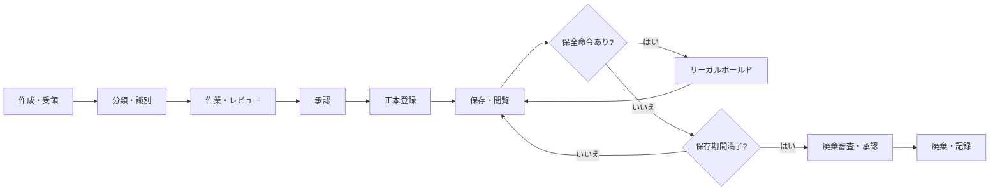

# 証跡・文書管理方針

## 1. 目的

監査計画、調書、受領証憑、監査報告、是正計画、完了証憑について、作成から保存・廃棄までの追跡性、機密性、完全性を確保するための方針案です。

## 2. 現状と計画

| 区分 | 内容 |
|---|---|
| 実装済み | ワークスペース内に、正本保管、閲覧履歴、保存期間、リーガルホールド、監査ログ等の要件記述がある |
| 計画 | OneDriveを草稿・共同編集、DirectCloudを確定文書・証憑の正本保管に使い分ける |
| 計画 | 閲覧、変更、承認、出力を改ざん困難なログへ記録する |
| 未確定 | 保存年限、廃棄承認、リーガルホールド発動者、命名規則、暗号化・バックアップ、RPO/RTO、電子署名方式 |

## 3. 文書のライフサイクル案

## 4. 管理対象と必須メタデータ案

| 文書・証跡 | 主なメタデータ |
|---|---|
| 年間・個別監査計画 | 計画ID、年度、対象、版、状態、作成者、承認者、承認日 |
| 証憑依頼 | 依頼ID、対象監査、依頼先、依頼内容、期限、状態 |
| 受領証憑 | 証憑ID、依頼ID、出所、対象期間、版、受領日、受領者、機密区分 |
| 監査調書 | 調書ID、対象監査、作成者、レビュー者、版、状態、関連証憑 |
| 発見事項・指摘 | 指摘ID、根拠、重要度、対象部門、改善責任者、期限 |
| 是正計画・完了証憑 | 指摘ID、提出者、提出日、版、再確認結果 |
| 操作ログ | 利用者、日時、対象、操作、結果、出力先等 |

## 5. 正本と草稿

- 草稿は作業中であることを表示し、正本と同じ保存場所・名称で混在させません。
- 正本は承認済み版を登録し、上書き変更を制限する計画です。
- 訂正が必要な場合は、旧版を保持し、変更理由と承認を付けた新版を登録する案です。
- メール、紙、外部媒体で受領した証憑の原本性確認・電子化手順は未確定です。

## 6. アクセス・出力

- 被監査部門は、自部門への依頼と提出物等、許可された範囲だけを閲覧します。
- 調書、発見事項、監査意見は監査関係者へ限定します。
- ダウンロード、印刷、外部共有、エクスポートは権限と目的に応じて制限し、記録する計画です。
- 外部専門家、会計監査人、内部監査部門への共有方法は未確定です。

## 7. 監査ログ

少なくとも、ログイン、閲覧、作成、変更、削除申請、承認、差戻し、ダウンロード、印刷、外部共有、権限変更を記録する案です。ログ自体は追記専用とし、通常管理者による改変を防ぐ要件があります。保管期間、監視責任者、アラート条件、ログレビュー頻度は未確定です。

## 8. 保存・廃棄・リーガルホールド

- 保存年限は文書種別ごとに、法令・監査役会規程・文書管理規程・訴訟対応方針を照合して決定します。
- 保存期間満了だけで自動削除せず、対象確認と承認を経る案です。
- 訴訟、調査、通報、紛争等に関係する資料は、通常の廃棄を停止するリーガルホールド対象となり得ます。
- 発動・解除権限、対象通知、解除確認、廃棄再開手順は未確定です。

## 9. 導入前の決定事項

1. 文書種別別の保存年限と起算日
2. 正本管理責任者、廃棄起案者、承認者
3. 機密区分、外部共有、持出し、印刷の規則
4. リーガルホールドの発動・解除手順
5. バックアップ、復旧、暗号化、障害監視の基準
6. 監査ログの保管、検索、定期レビュー、異常時対応

